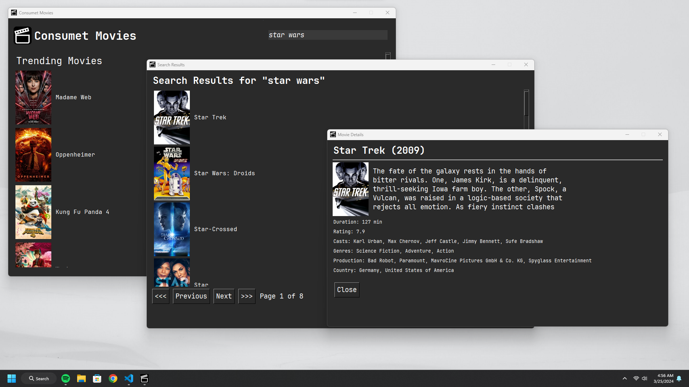

<div align="center">
	<h1>PT-TASK</h1>
	</img>
</div>


## Prequistites
- [`pip`](https://www.python.org) - Needed for dependencies

# Installation
## Linux / MacOS
```sh
$ git clone https://github.com/carrotshniper21/PT-Task
$ cd PT-Task
$ python -m venv venv && source venv/bin//activate && pip install -r requirements.txt 
```
## Windows
```sh
$ git clone https://github.com/carrotshniper21/PT-Task
$ cd PT-Task
$ python -m venv venv && .\venv\Scripts\activate && pip install -r requirements.txt 
```


### Contributors

- [carrotshniper21](https://github.com/carrotshniper21)
